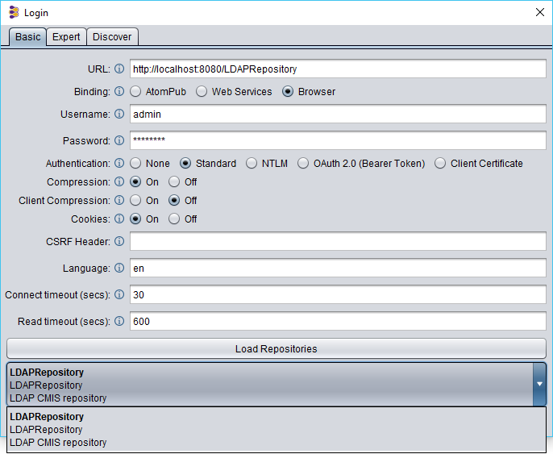

# Project Description

Copper CMS project implements the (OpenCMIS specifications)[http://docs.oasis-open.org/cmis/CMIS/v1.1/CMIS-v1.1.html]. It implements the following CMIS services,

1. Repository Service
2. Navigation
3. Object service
4. Discovery Service- Query Method not Supported
5. Versioning Service
6. Relationship Service
7. Policy Service
8. ACL Service

> Note: This only supports browser binding mode and not AtomPub/WebService.

> Query Service and Multi-Filing Service is not supported yet.

**This is an alpha version only, production usage is at the users risk to maintain, We are still finalizing the interfaces and customization options.**

# Requirements
* Java 8 SDK
* Maven

## Getting Started

> Use Eclipse Neon to have better development experience.

* Eclipse setup
   * Create a **Workspace** folder
   * Open the **Workspace** folder in Eclipse
   * Import the project as a **MAVEN project**

## Installing MongoDB 
* Download MongoDB from and  install it https://www.mongodb.com/download-center#community

### Running MongoDB in Command Prompt

* Copy the path of MongoDB where it installed from your machine, ex: C:\Program Files\MongoDB\Server\3.0\bin
* Change this path as root in Command Prompt
* Run mongod

## Running Copper CMS
* Build the code and generate jar/war file.
    * `mvn clean install -DskipTests=true`
* Specify the following environment variables,

| Environment Variable       | VALUE         | Required             |
| ------------- |:-------------:| -----:|
| CMIS_REPO_JSON_LOCATION      | c:\\json\\repojson.json | true |

* Example json file format
```
[
    {
        "repositoryId": "TestRepo",
        "repositoryName": "TestRepo",
        "db": {
            "type": "mongo",
            "connectionString": "127.0.0.1:27017;ContentDB"
        },
        "description": "TestRepo",
        "file": {
            "storage": "local",
            "location": "c:\\documents"
        },
        "login": {
            "type": "local",
            "users": [
                {
                    "userDetails": "admin:admin123",
                    "permission": "cmis:all",
                    "groups": [
                        {
                            "groupName": "admin",
                            "permission": "cmis:all"
                        }
                    ]
                }
            ]
        }
    }
]
```
> Note: The above repo.json is using local file system based repository management, this can be extended to any backend DB provided it follows the IRepository structure.

* Run the following command to start the server,

```
java -jar copper-0.1.1.jar
```

## LDAP for User management

Copper CMS also provides LDAP support for user management.

* Download and Install OpenLDAP from this link http://www.userbooster.de/en/download/openldap-for-windows.aspx 
* Start the OpenLDAP server by executing ~\openldap\run.cmd
    * Install LDAP browser to get the UI for OpenLDAP from this link http://www.ldapadministrator.com/

### Example repo json for LDAP

```
[
    {
        "repositoryId": "LDAPRepository",
        "repositoryName": "LDAPRepository",
        "db": {
            "type": "mongo",
            "connectionString": "127.0.0.1:27017;ContentDB"
        },
        "description": "LDAP CMIS repository",
        "file": {
            "storage": "local",
            "location": "c:\\documents"
        },
        "login": {
            "type": "ldap",
            "serverName": "localhost",
            "port": "389",
            "companyName": "",
            "adminUser": "admin:admin123",
            "masterCompany": "dc=example,dc=com",
			"userIdAttribute":"uid"
        }
    }
]
```
> Note: The above repo.json uses LDAP users, the permissions are read from LMCACL OpenLDAP attribute.

The LDAP support is tested only with OpenLDAP, for other LDAP server it needs tweaking, for ex: LMCACL attribute is not required when using Active Directory.

### Adding license to files

Run following command to copy new license into files.

```
mvn license:format -Dlicense.header=license.txt

```
### Run TCK test using jar file

* Do mvn clean and mvn -Dmaven.test.skip=true install and generate the jar in location copper-server/target copper-{project.version}.jar file.
* Run the jar file in command prompt as "java -jar copper-{project.version}.jar".
* Go to project location and run command "mvn install -pl chemistry-opencmis-test-tck" , it will run all tck module test.
* Check the TCK test result.

## Connecting via Apache OpenCMIS Workbench

> Note: Copper CMS doesn't allow to load repositories directly when you hit the top-level URL. It assumes the application knows to read the repository listing from another backend store to connect to that repository.

Apache OpenCMIS Workbench is a java application that allows to browse through the CMIS functionalities available on the server. You can use it to connect to Copper CMS as shown below,



> Download Apache OpenCMIS Workbench from this [link](http://chemistry.apache.org/java/download.html).

## Docker image

There are two flavors of the docker image, JAR and WAR modes. 

> The JAR mode is an embedded Tomcat 7 deployment.

* Build docker image as follows (from the root location)
```docker build -t copper-cms:latest -f build/jar/Dockerfile .```
* Run the docker image as follows,
```docker-compose -f build/jar/docker-compose.yml up -d```

* For customizations, inherit the image ```copper-cms:latest``` and define custom definitions.

> Note: Currently the Dockerfile is using openjdk:8-alpine as the base image.

Issues
------

Feel free to submit issues and enhancement requests.

Contributing
------------

Please refer to each project's style guidelines and guidelines for submitting patches and additions. In general, we follow the "fork-and-pull" Git workflow.

 1. **Fork** the repo on GitHub
 2. **Clone** the project to your own machine
 3. **Commit** changes to your own branch
 4. **Push** your work back up to your fork
 5. Submit a **Pull request** so that we can review your changes

NOTE: Be sure to merge the latest from "upstream" before making a pull request!

## Adding Aws Simple Queue Service ObjectFlow

* Adding objectFlow factory classpath in repository.properties file.
* Example - objectFlowManagerClass=com.pogeyan.cmis.aws.content.AwsObjectFlowFactory

### Example repo json for ObjectFlow

```
[
    {
        "repositoryId": "MongoTest",
        "repositoryName": "MongoTest",
        "db": {
            "type": "mongo",
            "connectionString": "127.0.0.1:27017;dd"
        },
        "description": "TestRepo",
        "file": {
        },
        "login": {
            "type": "local",
            "users": [
                {
                    "userDetails": "admin:admin123",
                    "permission": "cmis:all",
                    "groups": [
                        {
                            "groupName": "admin",
                            "permission": "cmis:all"
                        }
                    ]
                }
            ]
        }
    }
]
```
